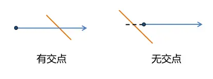

判断一个点是否在多边形内是处理空间数据时经常面对的需求，例如GIS中的**点选**功能、根据多边形边界筛选出位于多边形内的点、求交集、筛选不在多边形内的点等等。
 判断一个点是否在多边形内有几种不同的思路，相应的方法（感觉还谈不上算法）有：

- 射线法：从判断点向某个统一方向作射线，依交点个数的奇偶判断；
- 转角法：按照多边形顶点逆时针顺序，根据顶点和判断点连线的方向正负（设定角度逆时针为正）求和判断；
- 夹角和法：求判断点与所有边的夹角和，等于360度则在多边形内部。
- 面积和法：求判断点与多边形边组成的三角形面积和，等于多边形面积则点在多边形内部。

面积和法涉及多个面积的计算，比较复杂，夹角和法以及转角法用到角度计算，会涉及反三角函数，计算开销比较大，而射线法主要涉及循环多边形的每条边进行求交运算，但大部分边可以通过简单坐标比对直接排除，因此这是比较好的方法。

## 射线法的实现

**射线法**就是以判断点开始，向右（或向左）的水平方向作一射线，计算该射线与多边形每条边的交点个数，如果交点个数为奇数，则点位于多边形内，偶数则在多边形外。该算法对于复合多边形也能正确判断。


### 复合多边形的情况


 射线法的关键是**正确计算射线与每条边是否相交**。并且规定*线段与射线重叠或者射线经过线段下端点*属于不相交。首先排除掉不相交的情况，下图的情况都是需要排除掉的：


### 求交之前可排除的情况


 排除掉这些情况的函数如下：

```python
def isRayIntersectsSegment(poi,s_poi,e_poi): #[x,y] [lng,lat]
    #输入：判断点，边起点，边终点，都是[lng,lat]格式数组
    if s_poi[1]==e_poi[1]: #排除与射线平行、重合，线段首尾端点重合的情况
        return False
    if s_poi[1]>poi[1] and e_poi[1]>poi[1]: #线段在射线上边
        return False
    if s_poi[1]<poi[1] and e_poi[1]<poi[1]: #线段在射线下边
        return False
    if s_poi[1]==poi[1] and e_poi[1]>poi[1]: #交点为下端点，对应spoint
        return False
    if e_poi[1]==poi[1] and s_poi[1]>poi[1]: #交点为下端点，对应epoint
        return False
    if s_poi[0]<poi[0] and e_poi[1]<poi[1]: #线段在射线左边
        return False

    xseg=e_poi[0]-(e_poi[0]-s_poi[0])*(e_poi[1]-poi[1])/(e_poi[1]-s_poi[1]) #求交
    if xseg<poi[0]: #交点在射线起点的左侧
        return False
    return True  #排除上述情况之后
```

排除掉上述情况真正需要求交点来判断的情况只有两种：




### 需要求交的两种情况

函数isRayIntersectsSegment()里求交的部分就是利用两个三角形的比例关系求出交点在起点的左边还是右边；用图去理解如下：


求交的具体过程

最后判断的代码如下：


```python
def isPoiWithinPoly(poi,poly):
    #输入：点，多边形三维数组
    #poly=[[[x1,y1],[x2,y2],……,[xn,yn],[x1,y1]],[[w1,t1],……[wk,tk]]] 三维数组

    #可以先判断点是否在外包矩形内 
    #if not isPoiWithinBox(poi,mbr=[[0,0],[180,90]]): return False
    #但算最小外包矩形本身需要循环边，会造成开销，本处略去
    sinsc=0 #交点个数
    for epoly in poly: #循环每条边的曲线->each polygon 是二维数组[[x1,y1],…[xn,yn]]
        for i in range(len(epoly)-1): #[0,len-1]
            s_poi=epoly[i]
            e_poi=epoly[i+1]
            if isRayIntersectsSegment(poi,s_poi,e_poi):
                sinsc+=1 #有交点就加1

    return True if sinsc%2==1 else  False
```

我们取一个比较复杂的多边形进行测试，多边形和一些点如图：


测试用的有孔洞多边形

用isPoiWithinPoly()的测试结果如下：


测试结果

## 点在多边形内的应用

上面第一段已经描述了一些应用场景，下面给出一个应用的例子：有一堆点数据存在csv文件里，如何检索位于某个城市的点出来，检索出来之后的分析（例如加标签、改属性、做统计还是其他）这里不讨论，检索的结果统一写到新文件里。点输入的格式如下：


```css
id,name,wgslng,wgslat,score,adds
1,沃美,116.3309,40.0706,4.3,昌平回龙观同成街华联购物中心4楼
2,星美国际,116.446,39.916,5,金汇路8号世界城E座
3,……
```

城市边界为geojson格式，就是加了一些限定条件的json格式数据，如果需要详细了解geojson格式，可以参考本人之前的文章：[GEOJSON标准格式学习](https://www.jianshu.com/p/852d7ad081b3)。形如：


```json
{
  "type": "FeatureCollection",
  "features": [{
      "type": "Feature",
      "properties": {},
      "geometry": {
        "type": "Polygon",
        "coordinates":
         [
            [
              [108.71658325195312,34.231106222010531],
              [108.96240234375,34.168635904722734],
              [109.00222778320313,34.354774165387568],
              [108.80172729492186,34.35023911062779],
              [108.71658325195312,34.231106222010531]
            ]
          ]
        }
      }
  ]
}
```

下面的代码只考虑了Polygon的情况，对于MultiPolygon也是比较容易改的，要改为处理kml保存的边界数据也不难改。文中代码同步于本人[GitHub](https://links.jianshu.com/go?to=https%3A%2F%2Fgithub.com%2FQLWeilcf%2FLcfGeoProject%2Fblob%2Fmaster%2FpoiWithinPolygon.py)。

```python
import json
import csv
def pointInPolygon():
    gfile = './beijing_poly_wgs84.geojson' #utf-8编码
    cin_path = './poi_cinema_wgs84.csv'
    out_path = './beijing_poi_cinema_wgs84.csv' #输出文件

    pindex = [2, 3]  # wgslng,wgslat 在的位置

    with open(out_path, 'w', newline='') as cout_file:
        fin = open(cin_path, 'r', encoding='gbk') #出现编码错误就改编码 utf-8
        gfn = open(gfile, 'r', encoding='utf-8')
        gjson = json.load(gfn)
        polygon = gjson["features"][0]["geometry"]['coordinates'] #提取多边形,如果是4维数组需要相应的处理
        filewriter = csv.writer(cout_file, delimiter=',')
        w = 0
        for line in csv.reader(fin, delimiter=','):
            if w == 0: #写入表头 id,name,… 如果没有就去掉if语句
                filewriter.writerow(line)
                w = 1
                continue
            point = [float(line[pindex[0]]), float(line[pindex][1])]
            if isPoiWithinPoly(point, polygon): #在多边形内，写入新表
                filewriter.writerow(line)
            else:
                continue
        fin.close()
        gfn.close()
    print('done')
```

