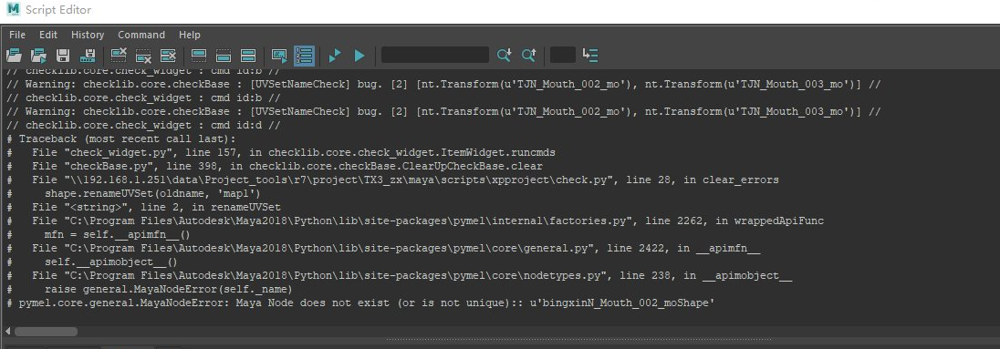

## test





## Run batch

```python
from subuserlib.subcmd import CommandGroup

cmdGrp = CommandGroup()
cmdGrp.setRunModule("assembly_asset_test")
cmdGrp.setName('test')
cmdGrp.addMayabatch(config={'source_file': source_file})
cmdGrp.run()

```


## markdownlib.discuss.Discuss2Markdown.report


Traceback (most recent call last):
  File "texteditor.py", line 59, in markdownlib.texteditor.TextEdit.report
  File "discuss.py", line 164, in markdownlib.discuss.Discuss2Markdown.report
  File "C:\Program Files\Autodesk\Maya2018\bin\python27.zip\os.py", line 157, in makedirs
WindowsError: [Error 5] : u'Q:/XX/.data/info/asset/files/char/c001001test/.type/look/v001/discuss'


## xpmanager.detail_file.read_source_data


Traceback (most recent call last):
  File "item_model.py", line 190, in xpexplorer.item_model.DataModel.updateExtendRows
  File "row.py", line 248, in xpexplorer.row.Row.update
  File "row.py", line 480, in xpexplorer.row.Row.reload
  File "detail_file.py", line 87, in xpmanager.detail_file.DataFile.read
  File "detail_file.py", line 31, in xpmanager.detail_file.DataFile.read_source_data
  File "detail_file.py", line 127, in xpmanager.detail_file.read_source_data
  File "detail_file.py", line 170, in xpmanager.detail_file.read_source_data
  File "C:\Program Files\Autodesk\Maya2018\bin\python27.zip\shutil.py", line 130, in copy2
  File "C:\Program Files\Autodesk\Maya2018\bin\python27.zip\shutil.py", line 83, in copyfile
IOError: [Errno 13] Permission denied: u'Q:/XX/.data/info/asset/files/char/c003010box/.type/look/v001/icon.png'


## xpexplorer.database.Database.save


Traceback (most recent call last):
  File "shot_build.py", line 100, in xpmanager.pp_work.shot_build.ShotBuild.start_build
  File "shot_build.py", line 162, in xpmanager.pp_work.shot_build.ShotBuild.build_cmd
  File "shot_build.py", line 209, in xpmanager.pp_work.shot_build.ShotBuild.build_from_config
  File "shot_build.py", line 218, in xpmanager.pp_work.shot_build.ShotBuild.run_batch_build
  File "run_build.py", line 43, in xputil.run_build.runBatchOpt
  File "database.py", line 24, in xpexplorer.database.Database.editData
  File "database.py", line 41, in xpexplorer.database.Database.save
IOError: [Errno 13] Permission denied: u'X:/TPZ/.data/info/task/207/data.json'


Traceback (most recent call last):
  File "shot_build.py", line 94, in xpmanager.pp_work.shot_build.ShotBuild.start_build
  File "shot_build.py", line 156, in xpmanager.pp_work.shot_build.ShotBuild.build_cmd
  File "shot_build.py", line 194, in xpmanager.pp_work.shot_build.ShotBuild.build_from_config
  File "detail_loader.py", line 438, in xpmanager.detail_loader.DetailLoader.create_task_datafile
IOError: [Errno 2] No such file or directory: u'X:/TPZ/.data/info/task/191/data.json'

raceback (most recent call last):
  File "shot_build.py", line 94, in xpmanager.pp_work.shot_build.ShotBuild.start_build
  File "shot_build.py", line 156, in xpmanager.pp_work.shot_build.ShotBuild.build_cmd
  File "shot_build.py", line 198, in xpmanager.pp_work.shot_build.ShotBuild.build_from_config
  File "shot_build.py", line 87, in xpmanager.pp_work.shot_build.ShotBuild.save_run_config_file
IOError: [Errno 2] No such file or directory: u'X:/TPZ/.data/info/task/207/run_config.json'


Traceback (most recent call last):
  File "header_view.py", line 188, in xpexplorer.header_view.HeaderControl.append_section
  File "loader.py", line 255, in xpexplorer.loader.Loader.append_column
  File "user_config.py", line 30, in xpexplorer.user_config.UserConfig.append
  File "user_config.py", line 60, in xpexplorer.user_config.UserConfig.save
IOError: [Errno 13] Permission denied: u'X:/TPZ/.data/info/shot/user_yyy__column.json'


## subuserlib.subcmd.LS_EXE_PATH


```python
from subuserlib import subcmd
import subuserlib.subcmd
subuserlib.subcmd.TEMP_DIR

from subuserlib.subcmd import CommandGroup
cmdGrp = CommandGroup()
cmdGrp.makedirs("d:/temp/test1")
cmdGrp.run()
```


