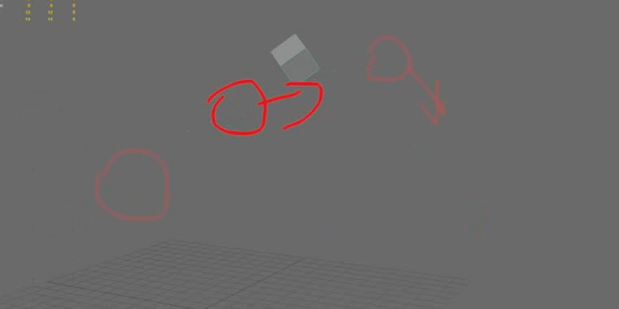
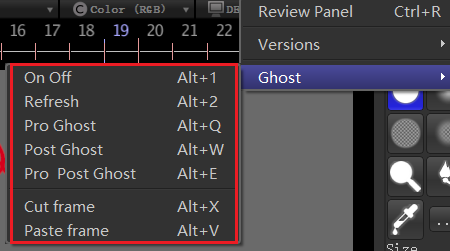

## RV 洋葱皮

菜单可忽略，使用快捷键操作。

### 快捷键说明

#### 1. 开关、更新

- alt+ 1 开关
- alt + 2 更新（绘制完之后更新）

#### 2. 重影显示模式切换

- alt + q 当前帧前的重影
- alt + w 当前帧后的重影
- alt + e 当前帧前后的重影

#### 3. 剪切、粘贴绘制

- alt + x 剪切当前帧的绘制
- alt + v 粘贴绘制

## 操作视频

<video src="images/Video_2023-05-11_151052.mp4"></video>

