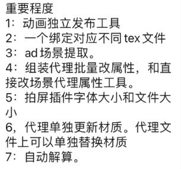
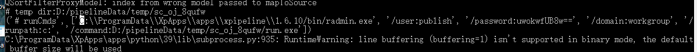
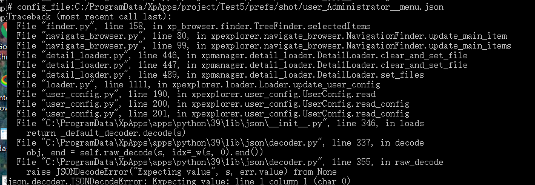
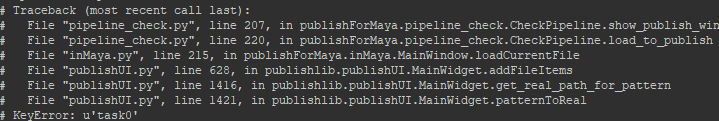

maya2024软件下载地址： 链接：https://pan.baidu.com/s/1lbwNjk-n_yFvIs7MoD15AQ  提取码：ge2a


- [x] |                  | 个人版 | 基础版 | 专业版 |
  | :--------------- | :----: | :----: | :----: |
  | 单人             |   √    |        |        |
  | 多人             |        |   √    |   √    |
  | 项目数量不限     |   √    |   √    |   √    |
  | 发布             |   √    |   √    |   √    |
  | 组装             |   √    |   √    |   √    |
  | 外包相关         |        |        |   √    |
  | 文件回收         |        |        |   √    |
  |                  |        |        |        |
  | 自动关联Deadline |        |        |   √    |
  | 数据可视化       |        |        |   √    |
  | pythonApi开放    |        |        |   √    |
  |                  |        |        |        |




- [ ] bbs

  - [ ] 1. 外包动画打包 

    2. 绑定一对多个额材质

    3. AD导出、组装

       

- [ ] 操作日志
  
  - [ ] 通过界面的所有操作自动记录操作内容、时间、人等
  
- [ ] 本地日志输出文件

- [ ] ```
  "filename": "{xp_common_cache_directory}/logs/users/{localhost}/xpipeline.log"
  ```

- [ ] ```
  "cache_temp_path": "D:/pipelineData",
  ```

- [ ] 

- [ ] 组装

  - [ ] 资产

     - [ ] 批量出tx
     - [ ] 资产检查、测试

  - [ ] 组装分析、日志分析

     - [ ] 添加错误数量列

  - [ ] 添加忽略细小错误,选项

  - [ ] abc参数: xgen头皮导出abc参数，根据运动模糊的参数，自动适配

  - [ ] ```python
    -frameRelativeSample -0.25 -frameRelativeSample 0 -frameRelativeSample 0.25
    ```

  - [ ] ass代理参数

  - [ ] 代理导出路径、规则（命名）可自定义，更好适配不同项目

  

- [ ] 镜头管理器

  - [ ] 动态预览图标，添加可刷新图标动画菜单
  - [ ] 用户操作日志（内容、时间等）

- [ ] 在系统托盘中右键菜单直接启动

- [ ] 组装运行中，保存内存等资源使用记录

  - [ ] 用于数据统计、分析、可视化

- [ ] maya中批量导出abc工具(解算环节、其他环节)

- [ ] 发布系统

  - [ ] 禁用窗口最大化

  - [ ] 

- [ ] python3

  - [ ] super user 发布任务
    
  - [ ] 读取用户数据错误时
    

- [ ] ## 流程软件

  - [ ] 添加主菜单、软件信息

  - [ ] 列编辑器：排序

  - [ ] 自定义搜索、过滤功能

  - [ ] #### 用户状态保存、加载（实时保存）

    - [ ] ui、layout布局保存

    - [ ] 恢复

  - [x] 命令类column，锁定用户编辑

  - [x] 用户可输入、存储数据（excel表格功能）
    
  - [x] 子item的数据存储问题
    
  - [ ] #### 统计、数据可视化

    - [ ] 状态栏中简单数据计算、统计

  - [x] python3测试

  - [x] 主题、风格切换

  - [ ] 唯一名字获取方式测试

- [x] 发布检查

  - [x] 异常、错误， 显示错误信息

  

- [ ] 资产发布（AD）

  - [x] ABC类型支持Gpu类型（可携带基础材质颜色等）
    - [ ] 扩展功能根据贴图颜色自动获取颜色


- [ ] 启动器
  - [ ] 项目相关bat文件隐藏
    - 启动器中启动时自动创建
    - 或保存主程序目录中

---


- [x] 系统文件快速访问（添加标签名字）

- [ ] ### 导航栏过滤
  
  - [ ] 环节独立显示
  - [ ] 根据用户名字
  - [ ] 分隔（类似maya大纲），独立显示收藏、自己的任务等
  
- [ ] 两侧边栏升级
  
- [ ] 右侧信息栏、添加任务概述
  
  - [ ] 制片、主管，可输入当前任务的相关描述等
  
- [ ] ### 授权规则
  
  - [ ] 1. 安装时开始计时（生成初始时间码、默认测试版本key）
  
      2. 有全局授权码 + 项目授权码
  
         1. 全局授权码无效时
  
      3. 无全局授权码
  
         1. 只识别项目授权码
  
         
  
- [ ] ### 不同的授权版本

- [ ] 授权文件中

  - [ ] 用户类型（用户权限）
  - [ ] 是否可自定义图标、自定义标题名字等（公司logo等）

  - [ ] 是否可修改主体颜色等

    - [ ] 是否有开发者相关功能（内部Python是否可用）

- [ ] 盘符映射时，先检查盘符是否存在、且是否正确

  - [ ] 盘符不符时，将重新映射

- [ ] 资源库<-->rv

  - [ ] 视频库

- [ ] Dailys系统

  - [ ] 程序化访问daily视频图片等

- [ ] ### 更新状态栏

  - [ ] 添加用户类型选择（不同用户，拥有不同权限）
  - [ ] 普通用户

  - [ ] 制片

  - [ ] 管理员

    - [ ] 开发者

- [ ] ### 解算组装、自动解算设置（07-02）

- [ ] 法线检查

  - [ ] 检查模型定点法线是否被锁定

- [x] 普通用户模式下，图像无法显示问题

- [ ] 导出abc时，自动忽略不存在的节点

- [x] 资产发布输出ad（可自定义输出路径）

- [ ] ### 组装

    - [ ] 可选择的材质、毛发文件版本

- [ ] 镜头组装任务，显示原始发布信息

  - [ ] 原发布文件版本等

- [ ] 发布记录在队列中显示

- [x] 运行日志打包

- [x] deadline渲染maya版本问题

  - [x] 开始任务时、自动获取maya版本

- [x] 启动器窗口，取消左右停靠功能

- [ ] 动画检查

  - [ ] 资产引用必须有空间名字

- [ ] 流程管理
  - [x] 公共、可写入的的缓存路径
    - [x] 视频--》序列缓存
  - [ ] 显示发布任务历史

- [ ] 镜头管理优化获取唯一名字的方法

  - [ ] 分割路径、获取关键名字

- [ ] 资产检查
  - [ ] 检查模型点是否有数值（冻结模型点）
  - [ ] 

- [ ] 身体资产--》改名 材质。。。

### 系统自检

- [x] 状态栏显示
  - [x] 自定义状态栏、分类显示更多内容
  
- [ ] 菜单编辑，菜单图标可自定义

- [ ] 发布账户，自动邮件问题

- [ ] 实时显示任务状态（是否在渲染、装配等）

- [x] 日志打包

- [ ] 检查cache盘空间(cache盘建议保留较大空间)
  - [ ] 界面显示相关信息
  - [ ] 删除cache（10天之前的缓存）

- [ ] 检查相关软件是否安装
- [ ] **测试服务器环境下运行权限问题**

- [ ] 资产组装任务，继承镜头功能

- [ ] 无标签时，使用默认值




### 组装

- [ ] 导出特效示意
- [ ] 导出场景
- [ ] Abc版本
  - [ ] 动画文件更新后，只勾选了组装材质文件，未勾选abc时
  - [ ] 自动查找上个版本的abc文件
- [ ] 标记颜色
- [ ] 基础库、文件调用
  - [ ] 通用灯光文件、渲染设置文件
- [ ] 双击对话框
  - [ ] 显示镜头资产详细信息


- [ ] 组装文件，资产根据类型自动分组(资产、背景、特效元素)
- [x] 导航栏展开时， 更新数字列显示(列宽度更新问题)
- [ ] 快速打开系统文件、目录（文件不存在时，报错、信息反馈）
- [ ] 搜索框
  - [ ] 自动保存用户搜索信息
  - [ ] 独立显示选择的item（镜头、资产）
- [ ] master
  - [ ] 用户参数，快速访问、存储方案
- [ ] Qt程序绘图
- [ ] master
  - [ ] 用户操作记录（用于错误追踪）
  - [ ] 用户操作关联状态栏
  - [ ] 界面相关操作
  - [ ] 用户选择操作


###  项目菜单

- [ ] 不同项目，不同项目菜单


- [ ] 镜头资产文件锁定通道栏
- [ ] kyt组装加载解算Abc
- [ ] 组装run_config使用自定义字典, 属性的方式访问数据
- [ ] 

### 无发布，组装

- [ ] 文件获取（File finder）


### 邮件

- [ ] 用户信息存储到 工具临时目录
  - [ ] 子用户可公用账户信息


- [ ] 组装任务正在运行时，状态显示
  - [ ] 再次运行新任务时提示

### ---


- [x] 资产 item行，高度问题 （高度递减模式）

- [x] 动画自动手柄帧
- [ ] 队列自动调整列宽度无效。。。


- [x] 根目录图标（镜头、资产图标）

- [x] python3测试

- [ ] 程序打包

- [ ] 编译
  - [ ] deadline测试渲染，通用化
    - [ ] 配置
  - [ ] _xp_launch模块


- [ ] 风格设置、权限
- [ ] 数据导出

  - [ ] 导出表格（csv）


- [ ] 分组功能

  - [ ] 分类
- [ ] 鼠标滚轮切换大小
- [ ] 导航栏

  - [ ] 图标可切换，，显示镜头缩略图
  - [ ] 字体可切换
  - [ ] 子线程中，自动更新子item数量


- [ ] 管理员模式（时间限制，超时自动失效）

- [ ] maya菜单，通过配置文件加载、控制

- [ ] 任务发布

  - [ ] 加入队列排队等待

### 镜头管理状态

- [ ] 镜头管理状态自动刷新：当前运行状态列
  - [ ] 状态、组装时间、作者列

  - [ ] 自动更新

- [x] 窗口显示时，运行一次队列刷新
  - [x] 卡顿问题
    - [ ] 先显示界面

    - [ ] 线程中运行

- [x] 组装自动邮件

- [x] glconfig.读入环境变量，，config.ihi配置

- [ ] 管理员&高级选项

  - [x] python默认不加载
  - [ ] 日志加载，配置文件可控


- [ ] G177 deadeline渲染
- [ ] 文件夹系统权限问题
  - [ ] 管理员账户测试
  
  
  
- [ ] 组装


  - [ ] 镜头子选项、镜头单独一行
  - [ ] 搜索栏

    - [ ] 回车 执行
    - [ ] 输入框菜单
    - [x] 显示字符删除按钮


### 属性编辑

- [ ] 类maya通道栏（批量属性设置、修改）

### - [ ] 状态栏

- [ ] 状态栏历史记录回看
- [ ] 界面操作历史记录
- [ ] 操作事件信息显示

### - [ ] 错误&日志

- [ ] 队列、任务优化
  - [x] 日志服务器化
  - [x] 任务重新开始(任务失败、停止时，可用)
  - [x] 任务立即开始（跳出当前队列、强制开始）
    - [x] 未开始、时可用
    - [ ] 只选择一条时可用

  - [ ] 删除日志
  - [ ] 删除任务栏

- [ ] 双击队列显示日志
- [ ] 常见错误提示
- [ ] python兼容模式
- [ ] 组装错误日志
  - [ ] 无abc
  - [ ] 模型大纲组命名错误

  - [ ] 无材质文件（文件命名错误、与绑定文件不匹配）

- [ ] column_editor 渲染dialog更新


### 队列任务(镜头显示)

- [ ] 显示错误
  - [ ] 错误数量
  - [ ] 错误列表
- [x] 队列信息，添加作者名字
- [ ] 收藏栏
  - [ ] 标签命名
- [ ] 显示内容返回、后退按钮
  - [x] 界面返回、前进 （类资源管理器、网页等）
- [ ] 队列任务(镜头显示)
  - [x] 根据队列任务独立显示镜头列表
  - [ ] 返回到导航栏中加载的镜头列
  - [ ] 
- [ ] 状态栏
  - [ ] 显示用户名字
  - [ ] 超级用户模式显示
  - [ ] 更新事件、信息等
- [ ] 管理员模式
  - [ ] 可打开python


### 启动环境统一

- [ ] 启动器，子程序状态跟踪
  - [ ] 开始、解算时间等

- [ ] rv
  - [ ] rv镜头参数环境加载、统一
- [ ] nuke
- [ ] houdini


- [ ] 队列类型（build all --> shot）


!()[mind\mind_test_1.txt]

[mind_test_1](mind\mind_test_1.txt)


#### - [ ] 环境初始化、测试
  - [ ] 项目环境设置好后
    - [ ] 生成组合配置（如：deadline直接可调佣的配置文件）
    - [ ] 运行项目环境测试


- [ ] 测试


### 镜头路径快速访问配置

### Deadline maya版本自动选择

- deadline 测试渲染序列转视频自动帧速率

### 渲染测试文件、灯光文件

## ---


## 2023-04-06

- [ ] houdini deadeline 发布


## 2023-03-31

- [x] 离线任务失败时的状态更新、反馈
  - [x] 进程状态检查（maya崩溃 ，抛出异常）


## 2023-03-30

- [ ] KYT组装场景版本问题


## 2023-03-28

- [ ] G117渲染测试


## 2023-03-27

- [ ] G117渲染测试


## 2023-03-24

- [ ] houdini节点属性链接
- [x] houdini  kyt abc版本问题
- [x] houdini镜头加载，无数据时报错问题
- [x] 组装自动创建渲染测试文件


## 2023-03-23

- [x] houdini 镜头流程


## 2023-03-22

- [x] kyt灯光工具
- [x] 动态图标，镜头显示资产时错误
- [x] 队列栏，实时更新开始时间、持续时间显示不正确


## 2023-03-14

- [x] Nuke素材库
  - [x] 序列播放


## 2023-03-13

- [ ] 


## 2023-03-10

- [x] 序列图播放


## 2023-03-09

- [x] 更新列命令错误问题


## 2023-03-08


- [x] 用户选项对话框优化，，
- [x] 自定义菜单、可双击打开路径
- [x] 测试渲染

  - [x] 渲染对话框，常规可控操作
  - [x] 可选择渲染层
  - [x] 分辨率百分比


## 2023-03-07

- [x] 搜索框
  - [x] 列加减时，更新搜索标签选择
  
    

## 2023-03-06

- [x] 组装完成自动发邮件
- [x] 改进搜索功能（可选择搜索标签）


## 2023-03-03

- [ ] ffmpeg EXR转视频，普通播放器问题

### 邮件、账户问题

- [ ] 简化调用接口
- [ ] 独立的邮件（用户）登录

### 主题、风格

- [ ] 界面主体、风格可自定义

### 自定义进度条（彩色）

- [ ] deadline完成、未完成、暂停的进度等，不同的颜色显示


### 路径索引自定义

- [x] 镜头、资产，可自定义路径索引（根据镜头快速索引相应的目录等）

  

####  - 文件筐

- [ ] ct文件筐

### 超级用户选项

- [ ] 测试版本、debug等

### 账户、注册


## 2023-03-02

### 加载进度显示

- [ ] 窗口加载进度显示（等待、进度条显示）
- [x] KYT
  - [x] 组装自动载入场景
- [x] 启动器根据 launch列表排序


## 2023-03-01

### 启动器
- [x] 启动器界面，无程序图标文件时，使用默认图标
  - [ ] Qt程序绘图-文字转图标

- [x] 启动器更新（适配支持多软件）
  - [x] houdini、nuke
  - [ ] houdini 启动时：自动更新 用户.env文件
  - [ ] 测试RV启动
    - [ ] 根据项目配置RV（项目相关的文件、路径引用）


## 2023-02-27

- [ ] 组装任务列表 **可实时显示新文件列表**

- [ ] 组装后台渲染，任务失败时界面反馈

- [ ] ## 界面语言

  - [ ] 镜头管理

- [ ] KYT 双击显示当前镜头中使用到的资产（材质、毛发文件）


## 2023-02-25

- [ ] ## 列风格

  - [ ] 可选择、
  - [ ] 可自定义等


## 2023-02-24

- [ ] ## 启动器

  - [x] 启动进程log获取（无效路径信息 提示等）

  - [x] 用户信息反馈、交互

  - [ ] 插件安装、信息提示等（安装用户maya用户菜单等）


- [ ] #### 组装文件详细是日志输出


- [ ] ## 镜头、资产文件筐

- [ ] 组装信息存储文件（可和UI共享数据）

- [ ] 数据刷新时，更新**所有相关数据**（自定义数据)

- [ ] ### 搜索过滤 

  - [ ] 搜索栏，添加 搜索哪一列选择项
> 


  - [ ] 数据独立显示(筛选、过滤), 根据选项的镜头，显示镜头相关任务

    - [ ] 独立显示选择镜头的相关任务


### 自动更新(自定义)图标


## 2023-02-23

### 镜头管理，列数据获取

- [ ] 可自定义Python命令


### bbbb


## 2023-02-21

- [ ] 邮箱
  - [ ] 邮箱密码临时路径问题
  - [ ] 邮箱名字、密码中文输入时的错误问题


## 2023-02-17

- [ ] 镜头组装， 无代理输出时的，，合并文件读取代理错误问题。。


## 2023-02-10

- [ ] 镜头管理器用户自定义列, 数据获取、运行自定义函数

- [ ] 解算abc组合时临时abc文件 -> tmp文件存储到 临时目录
  - [ ] 重新输出abc保留原始（属性输出）


## 2023-02-03

- [ ] 动画优化文件问题， 用户重复创建

- [ ] 动画曲线、延续帧


## 2023-01-17

- [ ] 后期后环节配合、文件版本问题
  - [ ] 资源引用文件管理，版本切换
- [ ] 各环节启动器
- [ ] 资产、资源浏览器


# 2022

## 2022-11-22

- [ ] xgen
  - [ ] xgen毛发文件，生长面、绑定等临时模型，需在不同组下
  - [x] xgen毛发部分生长面范围错误时，尝试移除错误的生长面
  - [x] 生长面打断链接，使用包裹


## 2022-11-18

- [ ] 数据编辑
    - [x] 添加列
    - [ ] 编辑属性、 保存数据、文件结构设计
   
- [ ] 后台接头(mayabatch)


## 2022-11-15

- [ ] 组装，只更新材质时，自动查找上一版abc文件
- [ ] 组装，更新 解算时 自动查找上一版abc文件


## 2022-11-11

- [ ] 项目数据库
  - [ ] 资产、镜头数据库设计
    - [ ] 名字、 提交时间、 修改时间、 制作人员


## 2022-11-04

- [ ] 详细的运行日志

## 2022-11-04

- [ ] 属性面板，可像maya属性（可以copy出来、多个镜头任务使用pin的方式固定显示）

- [ ] 自定义模式:abc导入时：模型定点如果有数值时，自动清理


## 2022-11-03

- [ ] 组装，，高亮显示最新文件、最新发布（未组装文件）


## 2022-11-01

- [ ] 资产库,加载、替换功能（替换reference、AD）


## 2022-10-27

- [ ] 资产库， 图标、生成临时文件


## 2022-10-22

- [x] RV-daily基础功能


## 2022-10-20

- [ ] 样式、显示相关参数可调整、可控(邮件发送样式、发布工具布局等)


## 2022-10-18

- [ ] 镜头管理器， 添加资产管理
    - [ ] 查看资产对应的、材质、毛发文件
    - [ ] 可自定义指定绑定对应的材质、毛发文件
    - [ ] 显示镜头中使用到的资产，显示空间名、真实文件名字（可切换）

- [ ] 运行关键日志信息捕捉、记录、显示（反馈用户显示）

- [ ] 邮件未登录时，发布完成后maya卡主

- [ ] 镜头管理器， 移除序号列


## 2022-10-17

- [ ] 邮件、无收件人时，忽略邮件发送

- [ ] 镜头使用资产指定（绑定资产、渲染材质资产版本等）


## 2022-10-14

- [x] 简略、可读的发布数据

- [ ] 后台模式（batch）发布时根据文件命名自动查找截图
    - [ ] 如果没有图，运行后台硬件渲染

- [ ] 资产、镜头管理，窗口改成可浮动、并列显示模式

- [ ] 资产自动测试系统

- [ ] 邮箱密码问题（用户输出错误时， 报错）

- [ ] 服务器最终资产修改后， 更新abc、 proxy等


## 2022-09-29

- [ ] browser默认载入按钮， 位置调整


## 2022-09-28

- [ ] 发布拆分时， 模型组重名问题

- [ ] 任务发布时的用户选项功能
  - [ ] 用户选项可自动保存
  - [ ] 加载还原选项
    - [ ] 是否收集贴图
    - [ ] 只发布组件


> X:\L22\Main_Production\Work_Grp\Assets\ENV\BH\TEX\maya


## 2022-09-27

- [ ] 资产贴图使用抓取方案, `只收集有效贴图`
- [ ] 场景中无贴图时， 不上传贴图
- [ ] 毛发资产重复发布时， 最终路径下多余的工程文件
- [ ] TPZ关联CT
- [ ] 发布详细日志记录


## 2022-09-26

- [ ] 发布、上传文件完整列表

- [ ] 菜单图标

- [x] 检查无邮件问题

- [ ] 如果覆盖之前的版本，记录此信息

- [ ] 简化的发布信息文件---发布文件

- [ ] check检查模型定点是否有数值


## 2022-09-25

- [ ] 材质发布默认包含毛发发布


## 2022-09-23

- [ ] 资产加载器, 可创建tab栏


## 2022-09-21

- [ ] 序列转视频、更新


## 2022-09-20

- [ ] 发布记录、历史
    - [ ] 资产发布
    - [ ] 镜头发布
    
- [ ] 拆分资产命名工具，自动命名
- [ ] 拆分资产发布，不能正确发布贴图问题
- [ ] 资产自动导出贴图文件夹相对路径问题

## 2022-09-19

- [ ] set 场景创建基本组问题
- [x] 编译更新mayabatch
- [ ] 资产发布，**将有效文件导出**
- [ ] 问题节点列表，长名字显示

- [x] 发布进度，嵌入主页面


## 2022-09-17

- [ ] 场景拆分时，自动判断命名有没被占用
- [x] 版本升级问题，获取最大版本号， 覆盖或者升级

## 2022-09-16

- [ ] 更新资产基础组创建AD
- [ ] dict_util 自定义字典， 字典clone
- [ ] tpz资产大纲命名确定
- [x] 命名检查、 大纲基础组创建
- [ ] 资产发布，，导出有效资产组, 固定命名的组导出

## 2022-09-15

- [ ] 文件组装，abc前后帧问题

## 2022-09-14

- [x] tpz外包工具， 非启动器方式加载
- [ ] DTYT外包工具

## 2022-09-13

- [ ] ~~演讲准备~~

## 2022-09-09

- [ ] 文件发布过程、详细进度显示

## 2022-09-08

- [x] 文件检查，类型（中文提示）

---

## 2022-09-07

- [x] 重新编译 maya.exe, 不显示命令行
- [x] 发布信息、在发布文件一份
- [x] 默认菜单是否加载
- [x] 邮件图片大小自动适配（大图缩小）
- [ ] 水印参数变量可调整

---


