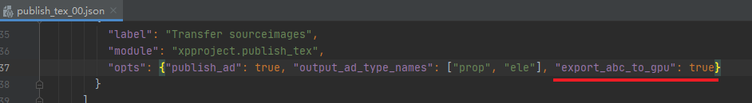
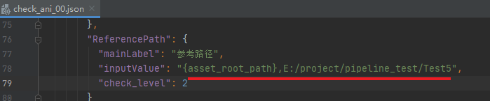
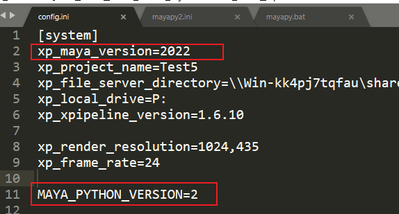
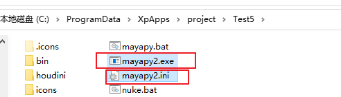
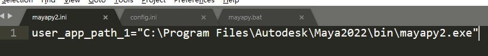
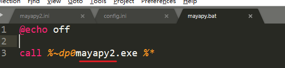
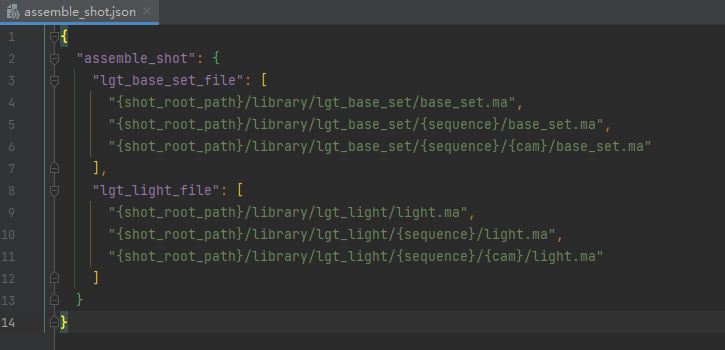
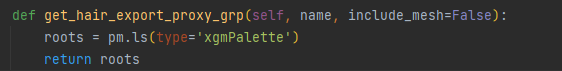
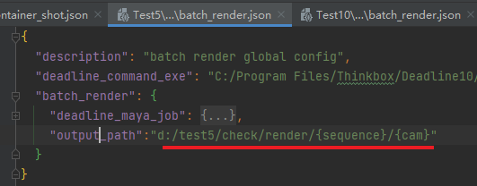
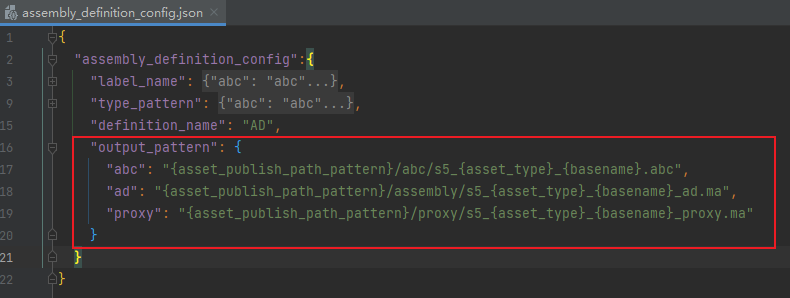

- [ ] - 项目资产库
  - AD资产库


## 2023-07-01


#### 组装可自定义解算路径
- [ ] 解算abc
- [ ] xgen ABC输出路径


####  绑定文件对应不同材质文件问题
  - 根据镜头可选绑定文件对应的材质文件版本
    - 相关数据可写到Excel表格中
    - 组装工具中指定材质资产版本

#### 资产发布（AD）

- [x] - ABC类型支持Gpu类型（可携带基础材质信息）
  - 

####  相机检查错误, 忽略锁定的属性

#### 参考路径检查可指定多个路径，用逗号隔开





### 2022maya相关设置



- 将原来的mayapy.exe 改名为 mayapy2.exe



- 同时创建一个mayapy2.ini的文档

```ini
user_app_path_1="C:\Program Files\Autodesk\Maya2022\bin\mayapy2.exe"
```



- 编辑mayapy.bat

  


---


## 2023-06-27

- 如果项目文件夹, 不在盘符根目录下, 可编辑这个参数


## 2023-06-26

- 获取灯光基础文件（渲染、渲染层设置的文件）

  > - 设置文件参数是列表类型，系统会从列表最后一个开始匹配(最后的优先级最高)
  >
  > - 依次通过场次、镜头号等匹配到适合当前镜头的基础设置文件  
  >
  > 灯光文件规则同理

  - lgt_base_set_file 渲染基础设置文件
  
  - lgt_light_file 标准灯光文件




- hair毛发代理中包括了模型问题
  - 根据xgen类型获取需要导出的节点




- 渲染测试文件输出路径设置

  


- 自定义资产AD输出路径
- 


## 2023-06-15

- 镜头管理中，右键显示资产信息
- 可自定义的文件快速访问