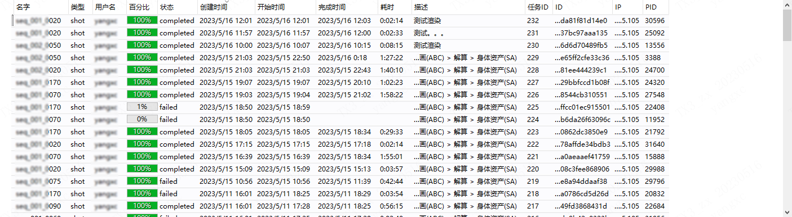
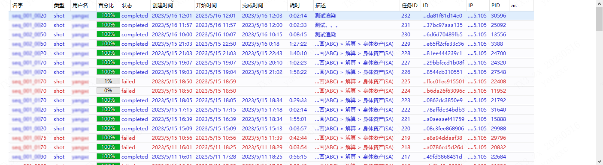
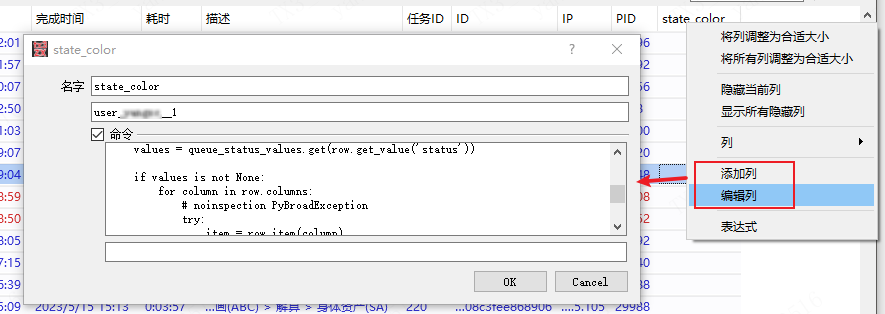
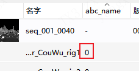

## config.ini

- 项目基础参数配置
- 所有参数将会自动添加到软件的环境变量中（如：maya）所有经启动器启动的软件都会继承公用这些环境变量

```ini
[system]
xp_maya_version=2020
xp_project_name=XX
xp_file_server_directory=\\file_server\data\projects
xp_local_drive=X:
xp_xpipeline_version=1.6.10
```

## config.json

- 项目详细的全局性参数配置

## 环境变量

- 环境变量可在config.ini中定义

### XP_STARTUP_OUTPUT_LOG_FILE

> 例如：\\\server\log\startup.log

程序启动日志输出文件。（可定义到服务器公共、可写入的文件中）


## 自定义右键菜单


## 自定义列

> 自定义列,可根据项目具体需求方便、灵活扩展
>
> - 可用户输入数据
> - 自定义列命令(python)或者第三方数据、文档数据等，在列中显示

### 样例1：根据任务状态显示不同颜色


- 无颜色



- 根据任务状态显示不同颜色




- 创建列、并编辑代码




#### 代码参考

```python
queue_status_values = {
    "completed": {9: [0, 0, .8, .8], 8: None},
    "working": {9: [0, .8, 0, .8], 8: None},
    "stop": {9: [.6, .6, .6, .8], 8: None},
    "failed": {9: [.8, 0, 0, .8], 8: None},
}

def main(row):
    values = queue_status_values.get(row.get_value('status'))

    if values is not None:
        for column in row.columns:
            # noinspection PyBroadException
            try:
                item = row.item(column)
                item.set_data(values)
            except:
                pass
    return None
```


### 样例2：显示abc文件状态（文件是否存在）



```python
import os

def main(row):
    # row = xm.views.shot.ls()[0]
    if row._data.get('type') != 'asset':
        return "-"
    else:
        asset_name = row._data.get('name')
    
        parent_row = row._items[0].parent().rowObj
    
        asset_info = parent_row._data.get('source_data').get('export_cache').get('asset_info')
        ani_abc = asset_info.get(asset_name).get('abc_ani_o')
        return int(os.path.isfile(ani_abc))

```


## 配置文件详细说明

### 资产


### 镜头

#### 组装配置（../presets/assemble_shot.json）

##### lgt_base_set_file

* 灯光基础配置 lgt_base_set_file, 在组装灯光文件时，自动引入文件中，此文件可以做好基础的渲染设置、渲染层等
* 可以根据项目、场次、镜头等细分，组装时将优先查找镜头、场次、项目中配置的设置文件，如果没有配置此项或者不能找到相应的文件，将创建默认灯光。


##### lgt_light_file 

- 配置同lgt_base_set_file

```json
{
  "assemble_shot": {
    "lgt_base_set_file": [
      "{shot_root_path}/library/lgt_base_set/base_set.ma",
      "{shot_root_path}/library/lgt_base_set/{sequence}/base_set.ma",
      "{shot_root_path}/library/lgt_base_set/{sequence}/{cam}/base_set.ma"
    ],
    "lgt_light_file": [
      "{shot_root_path}/library/lgt_light/light.ma",
      "{shot_root_path}/library/lgt_light/{sequence}/light.ma",
      "{shot_root_path}/library/lgt_light/{sequence}/{cam}/light.ma"
    ]
  }
}
```


